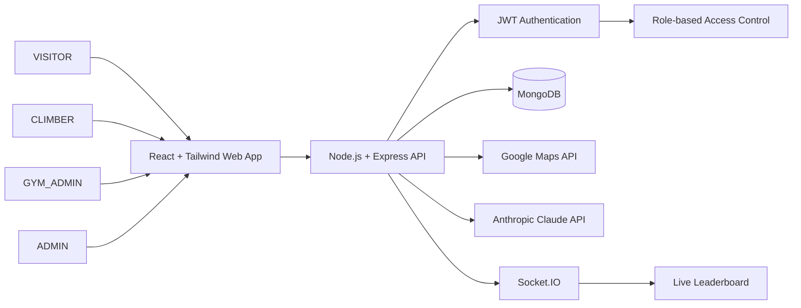

# TopSend Spec
_Version: 1.0 | Owner: TopSend Team | Status: Draft | Last Updated: 2026-10-03_

## 1. Problem Statement

TopSend is a Toronto-focused web platform for local indoor bouldering competitions. It is designed to bring the main workflow for a local competition into one system so that a climbing gym does not need either a broad gym-management solution or a basic scoring tool with no analytics.

The project is derived from the approved project documentation and focuses on the core workflow required to run a local bouldering competition:

- a gym administrator creates and manages competitions,
- climbers discover events and register,
- divisions and boulder problems are managed for the selected competition,
- official results are recorded and scored,
- live leaderboards and scorecards are displayed,
- route statistics are calculated from official results,
- the AI Route Assistant explains current competition data and route performance,
- AI does not change official scores, rankings, winners, or route grades.

The platform must support the approved roles: ADMIN, GYM_ADMIN, CLIMBER, and VISITOR. The VISITOR is an unauthenticated public user. The user does not select a role during login; the system retrieves the assigned role from the account after authentication.

### Measurable success criteria

- A gym can create and run a local bouldering competition in one workflow.
- A Climber can create an account, discover competitions, register, and view their event progress.
- A Gym Administrator can configure scoring and record official competition results.
- A System Administrator can review and approve Gym Administrator access requests.
- A competition leaderboard updates based on official saved results.
- The AI Route Assistant explains available competition statistics using official results and never modifies official competition data.

## 2. Scope & Non-Goals

### In Scope

- Toronto indoor climbing gyms and local bouldering competitions
- Shared login and role-based access control
- Climber account creation
- Gym registration and Gym Administrator access approval
- Gym administration
- Competition creation and management
- Divisions and registered Climbers
- Boulder problems / routes
- Scoring configuration and official result entry
- Competition discovery and List View
- Google Maps Competition Map View
- Competition registration and registration status
- Live leaderboards and rankings
- Scorecards and route statistics
- Competition history
- AI Route Assistant
- Responsive web experience for desktop, tablet, and mobile

### Non-Goals

- Provincial, national, or IFSC competition management
- Lead climbing or speed climbing support
- Full gym membership, payroll, POS, or employee scheduling features
- Native Android or iOS applications
- AI changing official scores, official results, rankings, winners, or route grades
- Automatic route grading via photographs or computer vision
- Support outside the Toronto local bouldering scope in the first version

## 3. Project Roles and Stakeholders

### Approved role names

| Role | Exact name | Description |
|---|---|---|
| ADMIN | ADMIN | System Administrator |
| GYM_ADMIN | GYM_ADMIN | Gym Administrator / Event Organizer |
| CLIMBER | CLIMBER | Climber |
| VISITOR | VISITOR | Unauthenticated/public user |

### Stakeholders and concerns

| Role | Primary concerns |
|---|---|
| ADMIN | Manage gyms, user permissions, access requests, and platform settings |
| GYM_ADMIN | Create competitions, manage divisions, create routes, record official results, manage event operations |
| CLIMBER | Discover competitions, register, view scorecards, view rankings, ask AI Route Assistant questions |
| VISITOR | View public information, create a CLIMBER account, submit gym registration or Gym Admin access requests |

## 4. User Stories

The approved user stories are the project source-of-truth and must not be merged, renamed, or reinterpreted.

### Iteration 1

- US-001: User Login
- US-002: Create Climber Account
- US-003: Admin Dashboard
- US-004: Manage Gyms
- US-005: Gym Details
- US-006: Manage Gym Administrators
- US-011: Gym Admin Dashboard
- US-012: Competition Creation
- US-013: Competition Details
- US-014: Divisions and Climbers
- US-015: Climber Details
- US-016: Routes / Boulder Problems
- US-017: Route Details
- US-018: Configure Scoring Format
- US-025: Discover Competitions
- US-026: Competition List View
- US-027: Competition Map View
- US-028: Event Registration
- US-029: Check Registration Status
- US-034: Submit Gym Registration
- US-035: Review Gym Administrator Access Requests

### Iteration 2

- US-007: Administrator Details
- US-008: Manage Users
- US-009: User Details
- US-010: System Configuration and Advanced Settings
- US-019: Result Entry
- US-020: Live Leaderboard and Displays
- US-021: Display Customization
- US-022: Route Statistics
- US-023: Gym Admin AI Route Assistant
- US-024: Competition History
- US-030: My Events
- US-031: My Scorecard
- US-032: Ranking and Leaderboard
- US-033: Climber AI Route Assistant

### Dependency rule

- Independent tasks may be completed before dependent tasks in the same iteration.
- If a task depends on a later user story in the same iteration, the task remains assigned to its original story and is marked as blocked until the required capability is available.
- User Story IDs are not redesigned, merged, or replaced to solve dependency ordering.

## 5. Functional Requirements

The project has 12 approved functional requirements, aligned to the requirement document and user stories.

### FR-001: Shared authentication and role access
- Inputs: username/email and password
- Preconditions: the account exists and the role is stored on the account
- Behavior: the system validates credentials through a shared login process and returns the correct role-based application context
- Outputs / side effects: authenticated session, role-based navigation, protected route access control
- Error cases: invalid credentials, expired or invalid session, unauthorized access attempt
- Priority: Must
- Linked User Stories: US-001
- Linked Acceptance Criteria: AC-001, AC-002

### FR-002: Climber account creation and gym-admin access requests
- Inputs: registration data for a new CLIMBER account or a gym access request
- Preconditions: the VISITOR is not authenticated; required fields are valid
- Behavior: the system allows a VISITOR to create a CLIMBER account or submit a request for gym registration or Gym Administrator access
- Outputs / side effects: new CLIMBER account or new pending admin request
- Error cases: duplicate email, invalid fields, denied request, missing required details
- Priority: Must
- Linked User Stories: US-002, US-034, US-035
- Linked Acceptance Criteria: AC-003, AC-004, AC-005

### FR-003: System Administration
- Inputs: gym, users, permissions, access requests, settings actions
- Preconditions: authenticated user has ADMIN role
- Behavior: the system allows an ADMIN to manage registered gyms, Gym Administrator accounts, users, permissions, and system settings
- Outputs / side effects: account approvals, permissions updates, gym records updated, settings saved
- Error cases: non-admin access attempts, invalid target account, unauthorized change
- Priority: Must
- Linked User Stories: US-003, US-004, US-005, US-006, US-007, US-008, US-009, US-010, US-035
- Linked Acceptance Criteria: AC-005, AC-006

### FR-004: Competition creation and management
- Inputs: competition details, gym association, capacity, date, location, description
- Preconditions: authenticated user has GYM_ADMIN role for the selected gym
- Behavior: the system creates and stores the competition linked to the correct gym and event configuration
- Outputs / side effects: competition record, registration state, participant capacity, event status
- Error cases: invalid competition data, unauthorized gym, missing details, invalid date
- Priority: Must
- Linked User Stories: US-011, US-012, US-013
- Linked Acceptance Criteria: AC-007, AC-008

### FR-005: Divisions and Climber management
- Inputs: division information and registered Climbers
- Preconditions: competition exists and the GYM_ADMIN has permission for that gym
- Behavior: the system allows creation of divisions and assignment of registered Climbers to each division
- Outputs / side effects: division record, assigned participant groups, competition-specific grouping
- Error cases: duplicate division names, invalid assignment, unauthorized assignment
- Priority: Must
- Linked User Stories: US-014, US-015
- Linked Acceptance Criteria: AC-009

### FR-006: Boulder problems / routes
- Inputs: route number/name, official V-grade, point value, notes
- Preconditions: competition exists; authorized gym staff are acting on that competition
- Behavior: the system stores official route data and ensures the route grade is controlled by authorized users
- Outputs / side effects: route record, official grade, notes, scoring metadata
- Error cases: invalid grade values, unauthorized modification, duplicate route identity
- Priority: Must
- Linked User Stories: US-016, US-017
- Linked Acceptance Criteria: AC-010

### FR-007: Competition discovery list view
- Inputs: available competition data and search/filter criteria
- Preconditions: the user is a CLIMBER or the feature is publicly available by project approval
- Behavior: the system displays upcoming competitions and allows filtering, viewing, and selection of an event
- Outputs / side effects: list of competitions, event details page navigation
- Error cases: no matching competitions, invalid filters, unavailable event details
- Priority: Must
- Linked User Stories: US-025, US-026
- Linked Acceptance Criteria: AC-011

### FR-008: Competition Map View with Google Maps
- Inputs: map request for competition locations
- Preconditions: Google Maps API is available and configured
- Behavior: the system shows map pins for available competition locations and allows map selection to open event details
- Outputs / side effects: map markers, navigation to event details
- Error cases: service unavailable, timeout, slow response, map load failure
- Priority: Must in the approved project requirement set
- Linked User Stories: US-027
- Linked Acceptance Criteria: AC-012

### FR-009: Competition registration
- Inputs: selected competition, division, Climber identity, status checks
- Preconditions: CLIMBER is authenticated, registration is open, and capacity remains available
- Behavior: the system validates the registration rules and confirms the Climber’s registration for the correct division
- Outputs / side effects: registration record, updated remaining capacity, status visible to the Climber
- Error cases: event closed, full capacity, duplicate valid registration, invalid division
- Priority: Must
- Linked User Stories: US-028, US-029, US-030
- Linked Acceptance Criteria: AC-013

### FR-010: Configure scoring format and record results
- Inputs: selected scoring format, route, Climber, attempts, sends, flash conditions
- Preconditions: competition exists and the user is GYM_ADMIN
- Behavior: the system stores the scoring format for the competition and records official Climber results according to the configured rules
- Outputs / side effects: official result saved, score recalculated, rankings updated
- Error cases: unsupported scoring format, unauthorized actor, partial save, invalid result payload
- Priority: Must
- Linked User Stories: US-018, US-019
- Linked Acceptance Criteria: AC-014, AC-015

### FR-011: Live leaderboards, rankings, and scorecards
- Inputs: official competition results and current event state
- Preconditions: official results exist for the current competition
- Behavior: the system displays live rankings and private scorecards using official results and role-based visibility rules
- Outputs / side effects: leaderboard updates, public and private display states, scorecard data
- Error cases: stale values, unauthorized viewing, failed update, public access not enabled
- Priority: Must
- Linked User Stories: US-020, US-021, US-031, US-032
- Linked Acceptance Criteria: AC-016, AC-017

### FR-012: Route statistics and AI Route Assistant
- Inputs: official results, route statistics, Climber data, current competition context
- Preconditions: route data and results are available
- Behavior: the system calculates completion rate, average attempts, and flash rate, and the AI Route Assistant explains available competition data and recommendations without modifying official data
- Outputs / side effects: route statistics, AI explanations, route recommendations, ranking comparisons
- Error cases: no data available, AI service unavailable, invalid prompts, attempt to mutate official result data
- Priority: Must
- Linked User Stories: US-022, US-023, US-024, US-033
- Linked Acceptance Criteria: AC-018, AC-019

## 6. Non-Functional Requirements

| ID | Category | Requirement | Measurement | Threshold | SLO |
|---|---|---|---|---|---|
| NR-001 | Performance | TopSend pages and normal user actions shall respond within acceptable times during regular use. | Page-load and common action tests | 95% of page loads and normal actions within 3 seconds, excluding unavailable third-party services | 95% |
| NR-002 | Security | Authenticated features and user credentials shall be protected from unauthorized access. | Authorization and password checks | 100% of protected-page authorization tests pass; passwords are not stored in plain text | 100% |
| NR-003 | Google Maps reliability | The Competition Map View shall remain usable even when Google Maps data is loading or unavailable. | Map service failure simulation | The map shall display markers or a clear loading/error state within 5 seconds; the list view remains available | 99% |
| NR-004 | Data integrity | Competition registrations, official results, scores, and rankings shall remain accurate when saved or when a save fails. | Save/refresh and transaction tests | No partial or duplicate record after a failed save; leaderboard and scorecard values match the latest valid official results | 99.9% |
| NR-005 | Usability | TopSend shall remain usable on common desktop, tablet, and mobile screen sizes. | Responsive layout testing | Core pages shall work at around 360px mobile, 768px tablet, and 1440px desktop without horizontal scrolling | 100% |
| NR-006 | Maintainability / error handling | Application errors shall be handled consistently and logged without exposing sensitive technical details to users. | Error handling and logging checks | User-facing errors are readable; server logs include timestamps and operation context; stack traces and sensitive technical details are not exposed to normal users | 100% |

## 7. Business Rules and Edge Cases

- VISITOR is not authenticated and cannot access protected routes.
- A CLIMBER cannot alter official results, rankings, winners, or route grades.
- ADMIN approval is required before a VISITOR becomes GYM_ADMIN.
- Climber self-registration does not require System Administrator approval.
- A GYM_ADMIN can only manage competitions and routes for their authorized gym.
- Registration is denied if a competition is closed or capacity is reached.
- A Climber cannot create a duplicate valid registration for the same competition.
- A competition remains associated with the correct gym and competition record.
- A route grade is controlled by authorized users and not altered by AI.
- An official result or leaderboard value must be derived from official saved results, not from AI-generated data.
- Failed saves must not leave partial or duplicate results behind.
- If Google Maps fails, the Competition List View still remains available.

## 8. Acceptance Criteria and Scenario Catalog

### AC-001: Shared login access
Given a registered ADMIN, GYM_ADMIN, or CLIMBER with valid credentials, when they submit the login form, then the system authenticates and grants access only to features allowed for that assigned role.

### AC-002: Invalid credentials
Given an invalid username or password, when a user attempts to sign in, then the system rejects the login and displays an appropriate error without granting access.

### AC-003: Climber self-registration
Given a VISITOR with valid account information, when they submit the registration form, then a CLIMBER account is created and the user can sign in with it.

### AC-004: Duplicate account rejection
Given a duplicate email or account identifier, when a VISITOR submits a registration request, then the request is rejected and a validation message is shown.

### AC-005: Gym Administrator approval flow
Given a VISITOR submits a gym registration or Gym Administrator access request, when an ADMIN approves it, then the request becomes active and the user can complete GYM_ADMIN setup; when rejected, then no GYM_ADMIN access is granted.

### AC-006: ADMIN enforcement
Given a non-ADMIN user, when they attempt to view or use a system-admin feature, then access is denied.

### AC-007: Competition creation
Given an authorized GYM_ADMIN, when they create a competition with valid details, then the competition is created and connected to the correct gym.

### AC-008: Capacity and event state
Given a competition is created, when a GYM_ADMIN sets capacity or registration state, then the value is stored and enforced for the event.

### AC-009: Division assignment
Given a competition and valid registered Climbers, when a GYM_ADMIN assigns a Climber to a division, then the assignment is saved for that competition only.

### AC-010: Official V-grade integrity
Given a route is created with an official V-grade, when the route is used in a competition, then the official grade remains authoritative and is not automatically changed by AI.

### AC-011: Competition discovery list view
Given a CLIMBER opens the available competitions page, when they filter or choose an event, then matching results are displayed and the event details page opens correctly.

### AC-012: Google Maps fallback
Given the Google Maps API is unavailable or slow, when the map view loads, then the system displays a loading or error state and the Competition List View remains usable.

### AC-013: Registration enforcement
Given a CLIMBER is authenticated and registration is open, when they register for a competition with capacity available, then the registration succeeds; if the event is full or closed, then it is rejected.

### AC-014: Official result entry
Given an authorized GYM_ADMIN records attempts and sends for a route, when the result is saved, then the official score is recalculated using the selected competition scoring format.

### AC-015: Partial-save safety
Given a result save fails, when the operation ends, then no partial or duplicate official result exists.

### AC-016: Live leaderboard updates
Given official results change during a competition, when the system recalculates leaderboard values, then the standings update without requiring a manual refresh.

### AC-017: Scorecard privacy and correctness
Given a CLIMBER views their scorecard, when they choose a competition, then they see their official results and progress, without seeing unauthorized management details.

### AC-018: AI explanation is data-grounded
Given official results exist, when a CLIMBER or GYM_ADMIN asks a route-related question, then the AI uses official competition data and not guessed or fabricated values.

### AC-019: AI never changes official competition data
Given AI provides recommendations or explanations, when it responds, then it does not modify official results, rankings, winners, or route grades.

### Scenario catalog

| Scenario type | Example |
|---|---|
| Happy path | CLIMBER registers for a valid competition |
| Negative path | Invalid credentials are rejected |
| Data integrity | Failed result save leaves no partial result |
| Admin flow | Gym Admin access request is approved or rejected |
| Edge case | Google Maps failure does not block Competition List View |
| AI guardrail | Recommendation explains route difficulty without changing official data |

## 9. Architecture and Technical Requirements

The approved project architecture is:

- React with TypeScript for the frontend
- Tailwind CSS for styling
- Node.js with Express.js for the backend
- MongoDB for data persistence
- Socket.IO for live leaderboard updates
- JWT for authentication
- RBAC for role-based access control
- Google Maps API for competition discovery and map view
- Anthropic Claude API for the TopSend AI Route Assistant
- Netlify for frontend hosting
- Render for backend hosting
- Git and GitHub for version control

### Architecture overview

TopSend uses a three-layer structure:

- Frontend layer: React web application for the user interface
- Application layer: Node.js + Express backend for business logic and API services
- Data layer: MongoDB storing users, gyms, competitions, divisions, routes, registrations, results, and statistics

### Security and system architecture notes

- JWT-based authentication protects protected routes and session handling.
- RBAC restricts access to ADMIN, GYM_ADMIN, and CLIMBER features based on the assigned role.
- Socket.IO manages real-time updates such as live leaderboards.
- Google Maps and AI services are called through the backend and fail gracefully when external services are unavailable.

### High-level system flow



## 10. Iteration and Dependency Planning

The current approved two-iteration plan is:

### Iteration 1

- US-001 User Login
- US-002 Create Climber Account
- US-003 Admin Dashboard
- US-004 Manage Gyms
- US-005 Gym Details
- US-006 Manage Gym Administrators
- US-011 Gym Admin Dashboard
- US-012 Competition Creation
- US-013 Competition Details
- US-014 Divisions and Climbers
- US-015 Climber Details
- US-016 Routes / Boulder Problems
- US-017 Route Details
- US-018 Configure Scoring Format
- US-025 Discover Competitions
- US-026 Competition List View
- US-027 Competition Map View
- US-028 Event Registration
- US-029 Check Registration Status
- US-034 Submit Gym Registration
- US-035 Review Gym Administrator Access Requests

### Iteration 2

- US-007 Administrator Details
- US-008 Manage Users
- US-009 User Details
- US-010 System Configuration and Advanced Settings
- US-019 Result Entry
- US-020 Live Leaderboard and Displays
- US-021 Display Customization
- US-022 Route Statistics
- US-023 Gym Admin AI Route Assistant
- US-024 Competition History
- US-030 My Events
- US-031 My Scorecard
- US-032 Ranking and Leaderboard
- US-033 Climber AI Route Assistant

### Iteration dependency rule

- Iteration 1 must be buildable without depending on a User Story from Iteration 2.
- Iteration 2 may depend on completed work from Iteration 1.
- Dependent work inside the same iteration is allowed to remain blocked, but the User Story itself is not redesigned or split to avoid the dependency.

## 11. AI Route Assistant Guardrails
~
The AI Route Assistant is part of TopSend, not GitHub Copilot or any development assistant used to write software.

The TopSend AI may:

- explain route performance,
- recommend routes to a Climber,
- compare route difficulty with the assigned grade,
- explain current point difference to a target ranking,
- answer questions using official competition statistics and current competition data.

The TopSend AI must never:

- modify official scores,
- modify official results,
- modify official rankings,
- choose competition winners,
- change official route grades,
- override the scoring rules or official result data.

## 12. Data Model Summary

The approved TopSend data model includes at minimum:

- users
- gyms
- Gym Administrator access requests
- competitions
- divisions
- boulder problems / routes
- registrations
- official results
- route statistics

### Core domain entities

```ts
interface User {
  userId: string;
  firstName: string;
  lastName: string;
  email: string;
  passwordHash: string;
  role: 'ADMIN' | 'GYM_ADMIN' | 'CLIMBER' | 'VISITOR';
  isActive: boolean;
}

interface Gym {
  gymId: string;
  name: string;
  location: string;
  status: 'PENDING' | 'ACTIVE' | 'INACTIVE';
  adminIds: string[];
}

interface GymAdminRequest {
  requestId: string;
  userId: string;
  gymId?: string;
  requestType: 'NEW_GYM' | 'EXISTING_GYM';
  status: 'PENDING' | 'APPROVED' | 'REJECTED';
}

interface Competition {
  competitionId: string;
  gymId: string;
  name: string;
  date: string;
  location: string;
  description: string;
  maxParticipants: number;
  registrationOpen: boolean;
}

interface Division {
  divisionId: string;
  competitionId: string;
  name: string;
}

interface Route {
  routeId: string;
  competitionId: string;
  routeNumber: string;
  name: string;
  grade: string;
  notes?: string;
  official: boolean;
}

interface Registration {
  registrationId: string;
  competitionId: string;
  climberId: string;
  divisionId: string;
  status: 'PENDING' | 'CONFIRMED' | 'WAITLIST';
}

interface OfficialResult {
  resultId: string;
  competitionId: string;
  climberId: string;
  routeId: string;
  attempts: number;
  sends: number;
  flash: boolean;
  officialScore: number;
}

interface RouteStatistics {
  routeId: string;
  completionRate: number;
  averageAttempts: number;
  flashRate: number;
}
```

## 13. Security and Compliance

- Passwords must never be stored as plain text.
- The system must use JWT authentication and RBAC.
- Protected routes must reject unauthorized access.
- System Administrator approval is required before GYM_ADMIN access is activated.
- A VISITOR cannot directly assign themselves GYM_ADMIN access.
- Sensitive technical details must not be displayed to normal users.
- The AI Route Assistant may operate only from official competition data, not from unvalidated or guessed values.

## 14. Review Gates

Before implementation begins, the following must be true:

- [ ] The spec matches the approved TopSend project documentation.
- [ ] All role names match the approved names: ADMIN, GYM_ADMIN, CLIMBER, VISITOR.
- [ ] User Story IDs are preserved exactly.
- [ ] Functional requirements align with the approved requirements document.
- [ ] Non-functional requirements align with the approved requirements document.
- [ ] Google Maps has both a functional requirement and measurable fallback behavior.
- [ ] AI guardrails are explicit and protect official competition data.
- [ ] Business rules cover duplicate registration, capacity, authorized gym management, and failed-save integrity.
- [ ] Architecture matches the approved technical requirements.
- [ ] Acceptance criteria remain testable and traceable to FRs and User Stories.

## 15. Traceability Summary

This specification is derived from the existing approved project files and is not an independent redesign of TopSend. It preserves the project’s approved scope, roles, story IDs, and requirements while documenting the implementation context needed for GitHub Copilot and the development team.

The main traceability anchors are:

- User stories in [docs/User_Stories/User_Stories.md](docs/User_Stories/User_Stories.md)
- Roles in [docs/Roles_and_Persona/Roles_and_Persona.md](docs/Roles_and_Persona/Roles_and_Persona.md)
- Requirements in [docs/Requirements/requirements.md](docs/Requirements/requirements.md)
- MVP in [docs/Mvp/mvp.md](docs/Mvp/mvp.md)
- Proposal and architecture in [docs/Project-Proposal/Project-Proposal.md](docs/Project-Proposal/Project-Proposal.md)

This file is the approved baseline for implementation planning and should be reviewed before coding begins.
